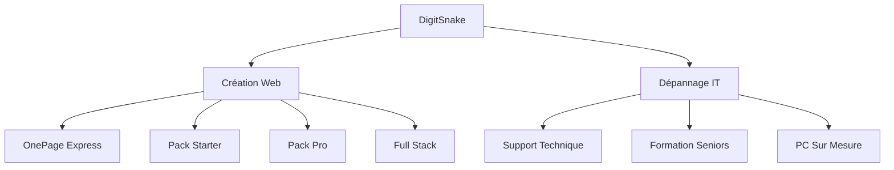
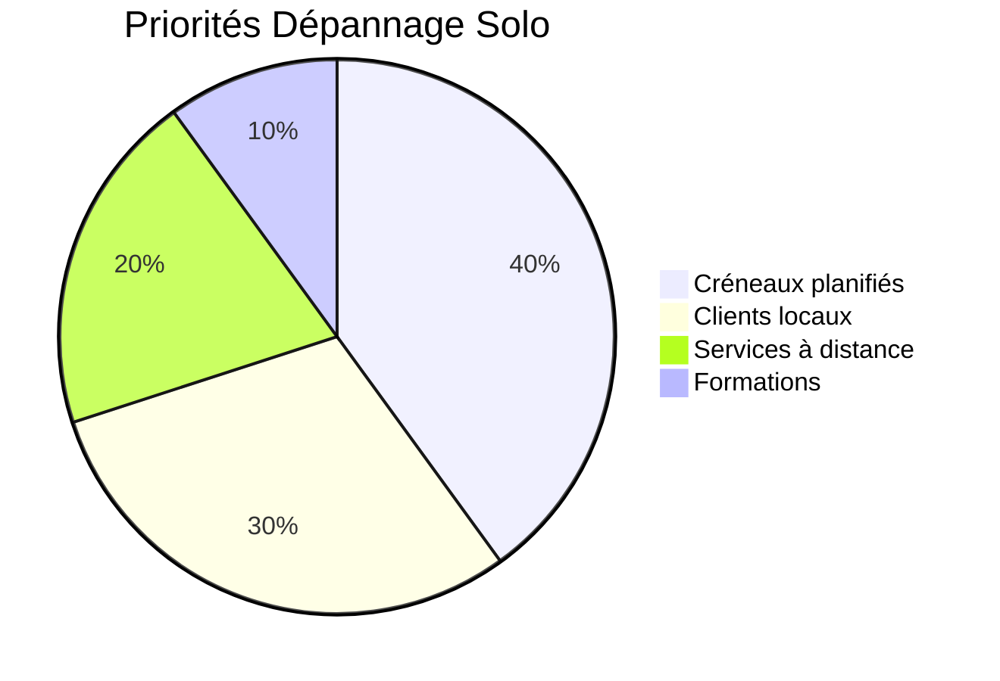
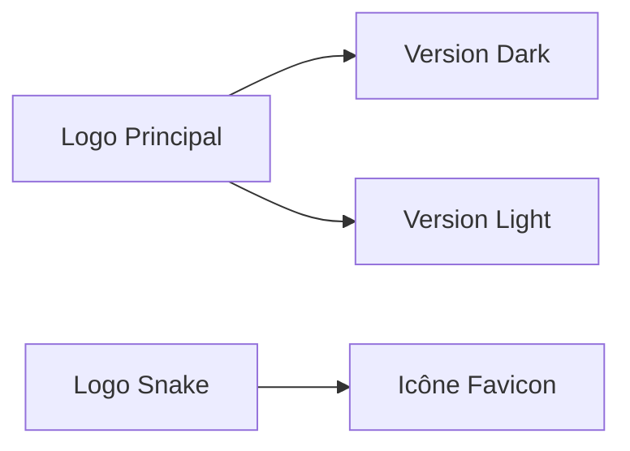
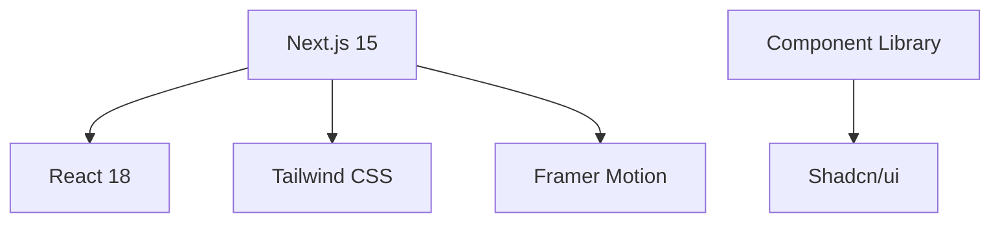
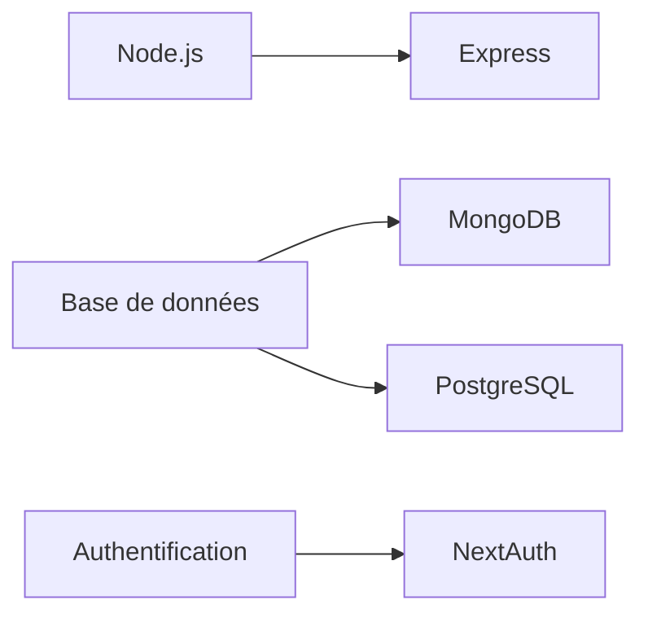
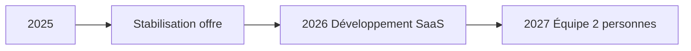

# 🐍 Cahier des Charges DigitSnake 2025 (Version Solo Optimisée)

## 🏢 Présentation Générale

**DigitSnake** est une entreprise individuelle spécialisée dans la création web moderne et le dépannage informatique. Notre mission : rendre la technologie accessible à tous (particuliers, seniors, PME) avec des solutions sur mesure, écologiques et transparentes. En tant que travailleur solo, chaque projet bénéficie d'une attention exclusive, avec une approche personnalisée et qualitative.

---

## 🎯 Objectifs Stratégiques

1. **Accessibilité numérique** : Réduction de la fracture numérique (spécial seniors)
2. **Solutions web modernes** : Sites performants et éco-conçus
3. **Transparence totale** : Tarifs clairs sans surprise
4. **Écologie numérique** : Matériel reconditionné privilégié
5. **Qualité premium** : Expertise technique personnalisée

---

## 💻 Offres de Création Web (Optimisées Solo)

### 🚀 OnePage Express
| **Aspect**       | **Détails**                                                                 |
|------------------|-----------------------------------------------------------------------------|
| **Description**  | Page vitrine unique pour présence en ligne rapide                           |
| **Livraison**    | 5 jours ouvrés (72h)                                                        |
| **Tarif**        | 350€ TTC                                                                    |
| **Inclus**       | Design responsive, optimisation SEO basique, 1 correction                  |
| **Options**      | Logo (+80€), Rédaction texte (+50€), Photos (+40€)                         |
| **Tech**         | HTML5/CSS3, JavaScript, Mobile-first                                       |
| **Note Solo**    | Délais garantis en jours ouvrés uniquement. Pas de service d'urgence soir/week-end. |

### 🌱 Pack Starter
| **Aspect**       | **Détails**                                                                 |
|------------------|-----------------------------------------------------------------------------|
| **Description**  | Site vitrine 3 pages (Accueil, Services, Contact)                          |
| **Livraison**    | 7 jours ouvrés                                                              |
| **Tarif**        | 550€ TTC                                                                    |
| **Inclus**       | Design personnalisé, formulaire contact, intégration Google Maps           |
| **Options**      | Page supplémentaire (+80€), SEO avancé (+120€)                             |
| **Tech**         | React, Tailwind CSS, Animations douces                                     |
| **Note Solo**    | Délais garantis en jours ouvrés uniquement. Pas de service d'urgence soir/week-end. |

### 🚀 Pack Pro (anciennement Pack Standard/Premium)
| **Aspect**       | **Détails**                                                                 |
|------------------|-----------------------------------------------------------------------------|
| **Description**  | Site 5 pages + fonctionnalités avancées                                    |
| **Livraison**    | 10-15 jours ouvrés                                                          |
| **Tarif**        | 950€ TTC                                                                    |
| **Inclus**       | Galerie statique, blog basique, SEO complet, nom de domaine 1 an          |
| **Options**      | E-commerce (+400€), Espace client (+300€)                                 |
| **Tech**         | Next.js, Node.js, MongoDB                                                  |
| **Note Solo**    | Délais garantis en jours ouvrés uniquement. Pas de service d'urgence soir/week-end. |

### ⚡ Full Stack (Sur Mesure)
| **Aspect**       | **Détails**                                                                 |
|------------------|-----------------------------------------------------------------------------|
| **Description**  | Application web complète avec backoffice                                   |
| **Livraison**    | À partir de 3 semaines                                                      |
| **Tarif**        | tjm 300-500€ HT/jour (selon complexité)                                    |
| **Inclus**       | Authentification, API, base de données, déploiement, support 1 mois       |
| **Exemples**     | SaaS métier, plateforme de réservation, outils collaboratifs              |
| **Tech**         | MERN Stack (MongoDB, Express, React, Node.js)                             |
| **Note Solo**    | Délais garantis en jours ouvrés uniquement. Pas de service d'urgence soir/week-end. |

### Conditions Communes
- **Corrections** : 1 aller-retour de correction strict inclus
- **Disponibilité** : Délais en jours ouvrés uniquement
- **Note Solo** : Attention exclusive mais sans disponibilité 24/7

---

## 🛠 Dépannage Informatique (Adapté Solo)

### 💰 Grille Tarifaire
| **Service**               | **Standard** | **Senior**  | **Conditions**                     |
|---------------------------|--------------|-------------|------------------------------------|
| Taux horaire              | 55€/h        | 44€/h       | Forfait 1h minimum                |
| Diagnostic                | 35€          | 28€         | Si non réparé                     |
| Installation OS           | 65€          | 52€         | Clé fournie par client            |
| Nettoyage + Optimisation  | 70€          | 56€         | Inclus antivirus                  |
| Formation (1h)            | 40€          | 32€         | À domicile ou en ligne            |
| Assistance à distance     | 45€          | 36€         | Sans déplacement                  |

### 📍 Frais de Déplacement
| **Distance** | **Tarif** |
|--------------|-----------|
| 0-10 km      | 20€       |
| 10-20 km     | 30€       |
| >20 km       | Sur devis |

### 💻 Création PC
| **Type**          | **Main d'œuvre** | **Garantie** | **Livraison** |
|-------------------|------------------|--------------|---------------|
| Bureautique       | 100€             | 1 an         | 3 jours       |
| Polyvalent        | 150€             | 2 ans        | 5 jours       |
| Gaming            | 200€             | 2 ans        | 7 jours       |

### Priorités en Mode Solo

---

## 🎨 Identité DigitSnake

### 🎌 Logos

### 🎨 Palette Couleurs
| **Couleur**       | **Usage**                | **Code**    |
|-------------------|--------------------------|-------------|
| Bleu Océan        | Arrière-plans, textes   | #051c29     |
| Turquoise         | Accents, liens          | #2ec4b6     |
| Orange Vif        | CTA, éléments importants| #ff9f1c     |
| Blanc             | Textes, éléments clairs | #f9fafb     |
| Rouge Energique   | Alertes, promotions     | #e71d36     |

### ✒️ Typographie
- **Titres** : Playfair Display (700)
- **Corps de texte** : Poppins (400)
- **Code** : Fira Code (500)

---

## ⚙️ Architecture Technique

### 🌐 Stack Frontend

### 🔒 Stack Backend

### 🚀 Déploiement
- **Hébergement** : Vercel (Web) + Render (Backend)
- **CI/CD** : GitHub Actions
- **Monitoring** : Sentry + LogRocket

---

## 📅 Gestion de Projet (Optimisée Solo)

### ⏱ Modèle Temporel

```mermaid
gantt
    title Semaine Type DigitSnake
    dateFormat  HH:mm
    section Création Web
    Projet A : 08:00, 4h
    Projet B : 13:00, 3h
    section Dépannage
    Client 1 : 10:00, 2h
    Client 2 : 15:00, 2h
    section Admin
    Factures : 17:00, 1h
```

### 📊 Limites Capacitaires
- **Projets web** : Max 3 simultanés
- **RDV dépannage** : Max 4/jour
- **Zone d'intervention** : 20km max
- **Jours sans RDV** : Mercredi (dédié aux projets)

---

## ✅ Engagements Qualité

### 🛡 Garanties
1. **Satisfait ou révisé** : 1 mois de corrections gratuites
2. **Transparence** : Devis détaillé avant engagement
3. **RGPD** : Conformité totale
4. **Écologie** : Matériel reconditionné certifié

### 📞 Support Client
- **Réponse sous** : 24h ouvrées
- **Canaux** : Email, téléphone, WhatsApp
- **Horaires** : Lun-Ven 9h-18h

---

## 📈 Stratégie Commerciale

### 🎯 Cibles Prioritaires
1. **Seniors** (65+) : Formation et assistance
2. **Auto-entrepreneurs** : Sites vitrine simples
3. **Commerces locaux** : Sites e-commerce basiques
4. **Startups** : Applications sur mesure

### 📣 Acquisition Clients
| **Canal**         | **Action**                          | **Budget** |
|--------------------|-------------------------------------|------------|
| Réseaux sociaux    | Tutoriels seniors (YouTube)         | 0€         |
| SEO local          | "dépannage informatique [ville]"    | 50€/mois   |
| Partenariats       | Clubs seniors, chambre commerce     | 100€/mois  |
| Parrainage         | 10% réduction par référence         | 0€         |

---

## 📝 Conclusion & Évolution

**DigitSnake** positionne son expertise sur :
- La qualité technique des réalisations
- L'accessibilité numérique
- L'approche écologique
- La transparence tarifaire

**Version :** 2.1 (Optimisée travail solo)  
**Validé le :** 7 juillet 2025  
**Contact :** contact@digitsnake.fr

> "Votre succès numérique commence par une relation humaine" - Philosophie DigitSnake

---

Ce cahier des charges intègre parfaitement vos spécifications initiales avec les optimisations nécessaires pour une activité solo, garantissant un équilibre entre qualité de service et qualité de vie.